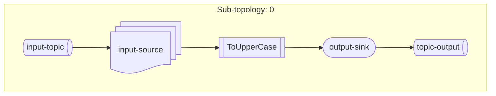

Pb: Kafka stream rendu des topologie de manière dynamique

# power point: on vise 5 minutes hahahaha

Context: 
Kafka spring kafka stream : faire un micro topo 

PainPoint: on a beaucoup de topologie KS a documenter et nos developpeur utilisent "hypothétiquement" internet pour faire des schemas.

Solution proposé : 
rendre disponible les rendus graphiques des topologies dans les applications 

# Explication orale

Nos choix :
moteur de rendu : mermaid souple rapide efficace 
type de diagramme : flowchart ca ressemble quand meme pas mal ce qu on veut en terme de rendu.
moteur de template : mustache facile simple natif java.
endpoint : actuator spring 

Methode : 
Test first avec une double boucle ? dis rui c'est quoi une double boucle ?
- test d'integration -> verfier que ca repond (verfication de la presence du signal)
- test unitaire/acceptance -> est ce que ca repond ce qu on attend (qualité du signal).

Topologies:
   Sub-topology: 0
    Source: input-source (topics: [topic-input])
      --> ToUpperCase
    Processor: ToUpperCase (stores: [store-history])
      --> output-sink
      <-- input-source
    Sink: output-sink (topic: topic-output)
      <-- ToUpperCase

